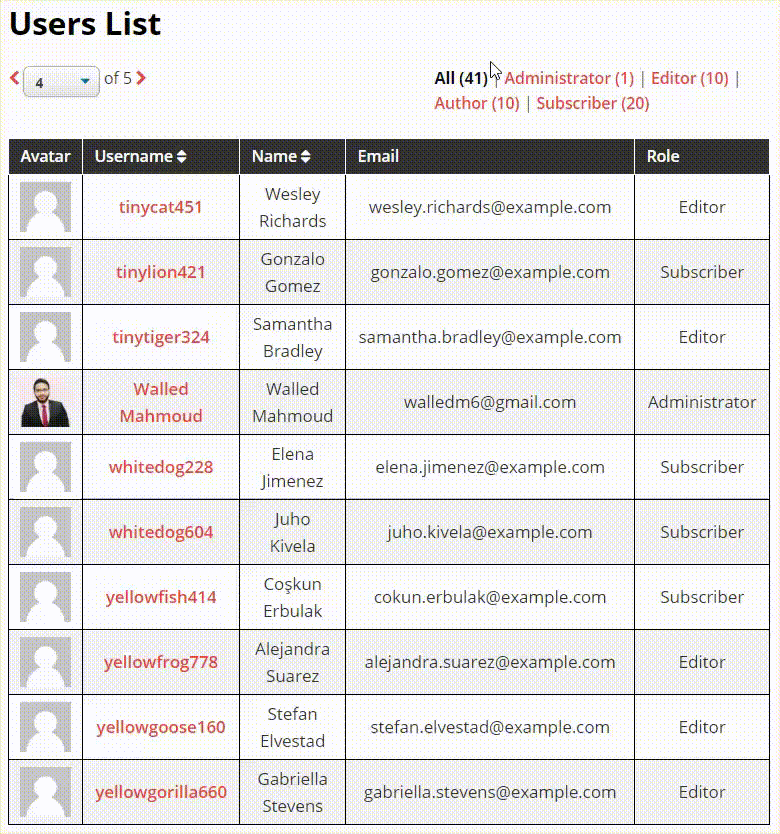

# Users-List
Plugin that creates a custom HTML table with a list of users that we can filter by role and order them in alphabetical order by display name and username

## Features

- This plugin creates a custom HTML table and print it in the frontend through a shortcode **[users_list_table]**.
- The table have a list of users that we can filter by role and order them in alphabetical order by display_name and username.
- The list is visible only to the admin user.
- The role filter and ordering works via AJAX.
- The plugin is translation-ready.

- Ordering works in both ascending and descending directions.
- If sorting order or what we're sorting by changes, the current role filter but go to the first page.
- If what role we are filtering by changes, we go to the first page with default sorting order and default what we're sorting by.
- If pagination changes the current sorting order maintains, what we're sorting by, and what role we're filtering by, and go to that page.

### Screenshot

